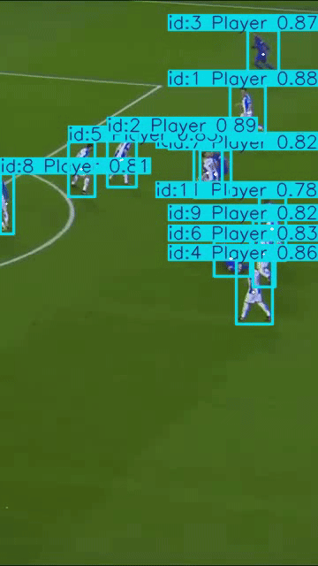
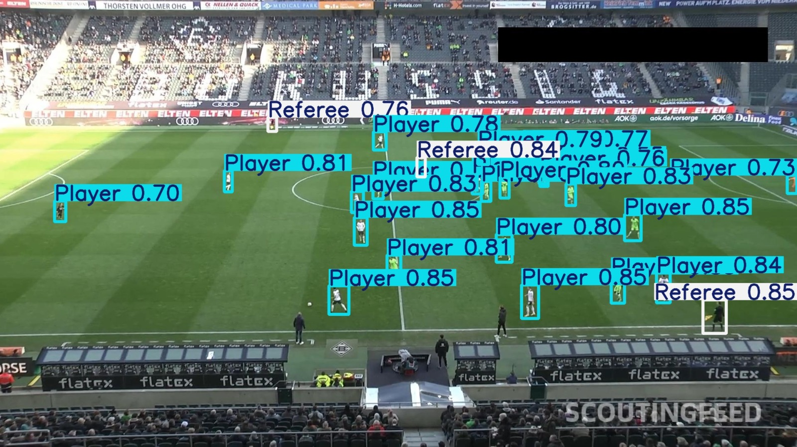
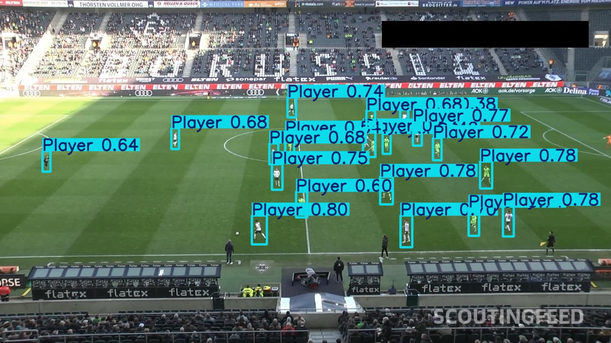
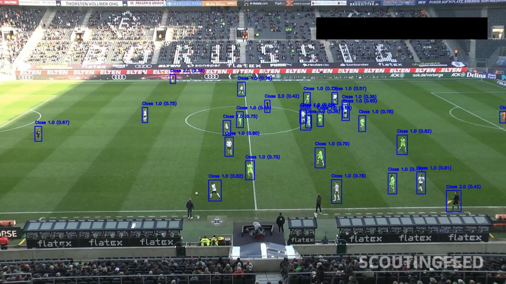

# SportTrack
tracking players and ball in sport

## Datasets Available
### detect football and players
* https://universe.roboflow.com/football-otrsl/football-player-detection-kucab-ofgzn
* https://universe.roboflow.com/university-of-oran-algeria/football-detection-vjuxg

* (SoccerNet v3 H250)[https://github.com/kmouts/SoccerNet_v3_H250]
### football player referee and goalkeeper
* https://www.kaggle.com/datasets/theoviel/soccernet-tracking
* https://www.kaggle.com/datasets/atomscott/soccertrack

### SportsMOT
players of 3(football, basketball and volleyball)
https://www.kaggle.com/datasets/ayushspai/sportsmot

### TeamTrack
soccer, basketball, and handball games
multi view tracking
https://www.kaggle.com/datasets/atomscott/teamtrack

### Approach
* Step 1: Initial Training
Train a YOLO model on football players and balls.

* Step 2: Prepare Mixed Player Data
Use a dataset containing basketball, volleyball, and football players without ball annotations.

* Step 3: Freezing Layers
Freeze the layers responsible for detecting footballs and players.
Train the unfrozen layers with mixed player data to generalize across all sports.

* Step 4: Validate
Test on football to confirm detection quality.
Evaluate on basketball and volleyball players for generalization.

Metrics at first dataset:
| Class      | Precision (P) | Recall (R) | F1-Score | mAP50 |
|------------|---------------|------------|----------|-------|
| Ball       | 0.88976       | 0.49999    | 0.64022  | 0.6127|
| Player     | 0.94752       | 0.96777    | 0.95754  | 0.9694|
| Referee    | 0.88898       | 0.85957    | 0.87403  | 0.9232|

Metrics at 2nd and 3rd dataset:
| Class      | Precision (P) | Recall (R) | F1-Score | mAP50 |
|------------|---------------|------------|----------|-------|
| Ball       | 0.91025       | 0.77554    | 0.83751  | 0.83682 |
| Player     | 0.96357       | 0.97938    | 0.97141  | 0.98788 |

Metric of first test after training in all datasets:
| Metric        | Precision  | Recall     | F1 Score   | mAP@0.5   |
|---------------|------------|------------|------------|-----------|
| Ball | 0.45094    | 0.29204    | 0.35450    | 0.20988   |
| Player | 0.88628    | 0.82558    | 0.85485    | 0.87965   |

Tracking video:

sample image of first model

sample image of 2nd model

result using WBF

